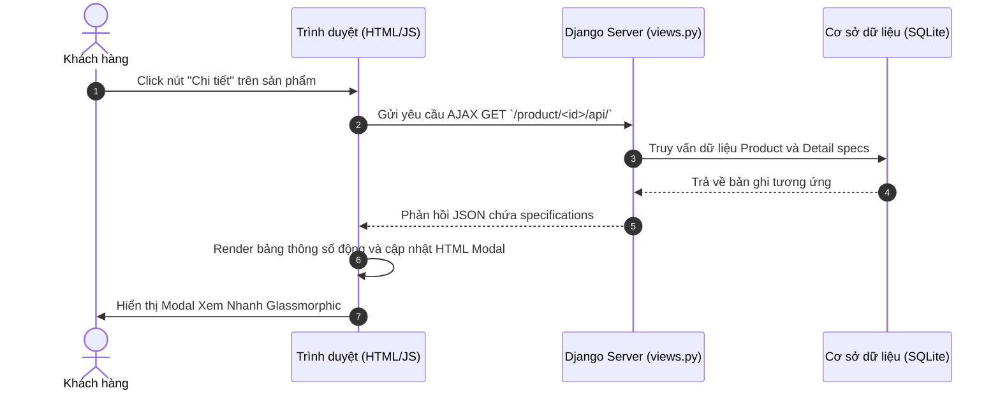
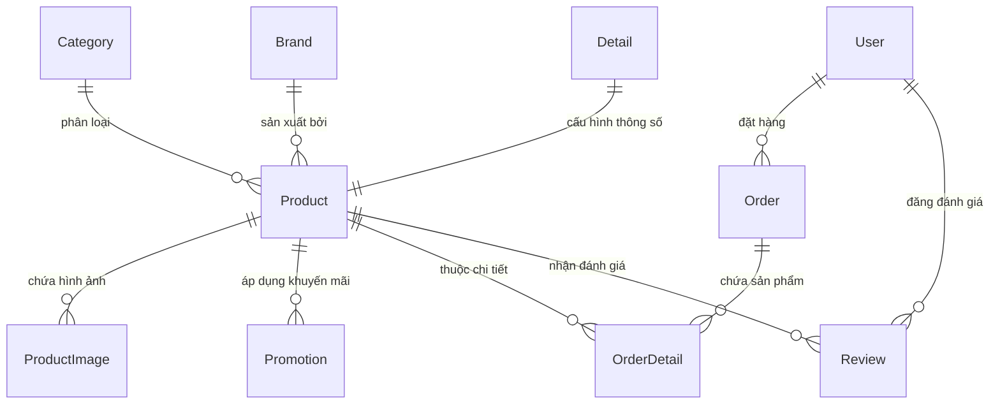

# 📱 Project DjangoWeb - Website Cửa Hàng Công Nghệ Premium (MyShop)

[](https://www.python.org/)
[](https://www.djangoproject.com/)
[](https://www.django-rest-framework.org/)
[](https://opensource.org/licenses/MIT)

**MyShop** là một hệ thống website thương mại điện tử chuyên nghiệp cung cấp thiết bị công nghệ (điện thoại di động, máy tính bảng, phụ kiện...) được thiết kế cực kỳ hiện đại, tối ưu và phát triển trên nền tảng **Django (Python)**. 

Dự án sở hữu giao diện **Glassmorphic** thời thượng, hệ thống tương tác không tải trang (AJAX) mượt mà cùng hệ thống REST API bảo mật cao tích hợp xác thực JWT, mang đến trải nghiệm mua sắm đẳng cấp tương tự các trang thương mại điện tử hàng đầu.

---

## 📌 Mục Lục
1. [Tính Năng Nổi Bật](#-tính-năng-nổi-bật)
2. [Sơ Đồ Hệ Thống & Luồng Hoạt Động](#-sơ-đồ-hệ-thống--luồng-hoạt-động)
3. [Công Nghệ & Thư Viện Sử Dụng](#-công-nghệ--thư-viện-sử-dụng)
4. [Kiến Trúc Cơ Sở Dữ Liệu](#-kiến-trúc-cơ-sở-dữ-liệu)
5. [Cấu Trúc Thư Mục Dự Án](#-cấu-trúc-thư-mục-dự-án)
6. [Hướng Dẫn Cài Đặt & Khởi Chạy](#-hướng-dẫn-cài-đặt--khởi-chạy)
7. [Địa Chỉ Truy Cập Mặc Định](#-địa-chỉ-truy-cập-mặc-định)
8. [Tác Giả & Bản Quyền](#-tác-giả--bản-quyền)

---

## 🌟 Tính Năng Nổi Bật

### 🎨 Giao Diện Khách Hàng (Front-End & UX/UI)
*   **Thanh Điều Hướng Glassmorphic Premium**:
    *   Sử dụng hiệu ứng mờ kính phủ sa (`blur(20px) saturate(180%)`) kết hợp đổ bóng mềm và viền gradient cao cấp.
    *   Tự động căn chỉnh dọc hoàn hảo bằng CSS Flexbox giúp trải nghiệm người dùng luôn đồng bộ.
    *   Hỗ trợ tương thích hiển thị hoàn hảo (`Responsive Grid Stack`) trên mọi thiết bị di động.
*   **Nút Xem Nhanh Sản Phẩm (Quick View Modal)**:
    *   Tích hợp nút **Chi tiết** trên từng thẻ sản phẩm tại trang chủ.
    *   Khi click, hệ thống tự động gọi AJAX đến API lấy bảng thông số kỹ thuật (Màn hình, Chip, RAM, Camera, Pin, Sạc...) và hiển thị trong một cửa sổ popup Glassmorphism sang trọng mà không cần tải lại trang.
*   **Bộ Lọc Giá Sản Phẩm Thời Gian Thực (AJAX Price Filter)**:
    *   Thanh trượt lựa chọn khoảng giá tương tác thông minh.
    *   Hiển thị nhãn giá tiền thực tế khi đang kéo slider và tự động cập nhật lưới sản phẩm bằng AJAX ngay khi người dùng thả chuột.
*   **Mở Khóa Chi Tiết & Bình Luận Cho Khách**:
    *   Khách vãng lai chưa đăng nhập vẫn thoải mái đọc thông số sản phẩm và xem các bình luận trước đó mà không bị bắt buộc đăng nhập.
    *   Tích hợp tính năng **Đánh giá & Chấm điểm sao (Product Reviews)** 1-5★ cho các thành viên đã đăng nhập.
*   **Trang Thanh Toán & Mã QR Động VietQR**:
    *   Khách hàng có thể nhập đầy đủ thông tin nhận hàng (Họ tên, Địa chỉ, Số điện thoại, Ghi chú).
    *   Tích hợp tự động tạo mã QR quét thanh toán động bằng công nghệ VietQR liên kết ngân hàng MB Bank dựa trên số tiền đơn hàng và mã đơn hàng cụ thể.
    *   Hỗ trợ copy nhanh số tài khoản và nội dung chuyển khoản chỉ với một cú click chuột.
*   **Hệ Thống Thông Báo Động (Slide-in Cart Toast)**:
    *   Khi thêm sản phẩm vào giỏ hàng thành công, một hộp thoại thông báo bo góc tròn sang trọng sẽ tự động trượt ra từ góc màn hình và ẩn sau 1 giây mà không gây gián đoạn.

### 🔑 Xác Thực & Quản Lý Người Dùng
*   **Luồng Đăng Ký / Đăng Nhập Không Tải Trang (AJAX Authentication)**:
    *   Các chức năng đăng ký, đăng nhập và quên mật khẩu được thiết lập thông qua các API AJAX với các hộp thoại Toast phản hồi trạng thái động trực quan.
    *   Hỗ trợ nút hiển thị/ẩn mật khẩu thông minh nâng cao bảo mật.
    *   Sau khi đăng ký thành công sẽ tự động chuyển hướng mượt mà sang đăng nhập; đăng nhập thành công sẽ hiển thị tên đầy đủ của người dùng tại góc lời chào trên Header.

---

## 📊 Sơ Đồ Hệ Thống & Luồng Hoạt Động

### Sơ Đồ Luồng Xem Nhanh Chi Tiết Sản Phẩm (Quick View Flow)


---

## 🛠️ Công Nghệ & Thư Viện Sử Dụng

*   **Ngôn Ngữ**: [Python 3.13+](https://www.python.org/)
*   **Web Framework**: [Django 6.0.5](https://www.djangoproject.com/) (Hỗ trợ cấu trúc định tuyến và xử lý cơ sở dữ liệu mạnh mẽ)
*   **Web Design System**: Vanilla CSS, FontAwesome 5+, Google Fonts (Outfit & Inter), Bootstrap Icons
*   **Tương tác động**: jQuery 3.6+ và AJAX (Xử lý giỏ hàng, bộ lọc và xem nhanh không tải lại trang)
*   **Cơ Sở Dữ Liệu**: SQLite (Đi kèm sẵn file dữ liệu thử nghiệm thuận tiện cho việc chạy trực tiếp)
*   **Cổng API Khác**: VietQR Dynamic API (`https://img.vietqr.io`) để tự động kết xuất mã QR thanh toán ngân hàng.

---

## 💾 Kiến Trúc Cơ Sở Dữ Liệu

Hệ thống sở hữu cấu trúc cơ sở dữ liệu quan hệ chặt chẽ và chuẩn hóa để lưu trữ và liên kết dữ liệu thiết bị công nghệ:



### Bảng Mô Tả Các Models Chính
| Model | Mô Tả | Thuộc Tính Chính |
| :--- | :--- | :--- |
| **Category** | Danh mục phân loại sản phẩm. Hỗ trợ cây danh mục cha-con. | `name`, `description`, `icon`, `category_parent` |
| **Brand** | Thương hiệu nhà sản xuất. | `name`, `description`, `country`, `icon` |
| **Detail** | Thông số phần cứng chi tiết của thiết bị công nghệ. | `screen`, `operating_system`, `rear_camera`, `front_camera`, `chip`, `RAM`, `memory`, `sim`, `battery`, `adapter` |
| **Product** | Thông tin sản phẩm cốt lõi. | `name`, `price`, `stock_quantity`, `image`, `status`, `detail_id`, `brand_id`, `category_id` |
| **Promotion**| Khuyến mãi giảm giá cho sản phẩm theo thời hạn cố định. | `discount` (%), `start_date`, `end_date` |
| **Order** | Giỏ hàng tạm thời và Đơn hàng đã hoàn thành của người dùng. | `user`, `create_date`, `total_amount`, `phone`, `address`, `status` (0: Giỏ hàng, 1: Đã thanh toán) |
| **OrderDetail**| Chi tiết sản phẩm, số lượng và tổng tiền trong đơn hàng. | `order`, `product`, `quantity`, `amount` |
| **Review** | Các đánh giá sao và bình luận của người mua đối với sản phẩm.| `product`, `user`, `rating` (1-5★), `comment`, `created_at` |

---

## 📂 Cấu Trúc Thư Mục Dự Án

```text
ProjectKTHP_Python2/
├── ProjectKTHP_Python2/
│   ├── README.md               <-- File tài liệu hướng dẫn này
│   └── django_web/
│       └── myweb/              <-- Thư mục gốc dự án Django
│           ├── manage.py
│           ├── db.sqlite3      <-- Cơ sở dữ liệu SQLite cấu hình sẵn dữ liệu mẫu
│           ├── myweb/          <-- Thư mục cấu hình Settings/Urls
│           └── myshop/         <-- 📦 Ứng dụng cửa hàng công nghệ chính
│               ├── admin.py
│               ├── forms.py    <-- Biểu mẫu Form (Review, Auth...)
│               ├── models.py   <-- Các lớp mô hình Cơ sở dữ liệu
│               ├── urls.py     <-- Khai báo điểm cuối URLs và APIs
│               ├── views.py    <-- Bộ điều khiển Logic & JSON API
│               ├── user_views.py <-- Xử lý AJAX Auth (Đăng nhập, Đăng ký...)
│               ├── static/     <-- Tài nguyên tĩnh (CSS, JS, Hình ảnh sản phẩm)
│               └── templates/  <-- Hệ thống giao diện HTML Templates
│                   ├── base/
│                   │   └── __base.html     <-- Khung xương giao diện & CSS/JS dùng chung
│                   ├── cart/               <-- Giỏ hàng, Đặt hàng & VietQR
│                   ├── common/             <-- Phần giao diện tái sử dụng
│                   ├── product/            <-- Chi tiết sản phẩm & Lưới lọc AJAX
│                   └── index.html          <-- Trang chủ chính
└── .git/
```

---

## 🚀 Hướng Dẫn Cài Đặt & Khởi Chạy

Làm theo các bước đơn giản dưới đây để thiết lập và chạy thử website trên thiết bị của bạn:

### Bước 1: Clone dự án và di chuyển vào thư mục chứa mã nguồn
Mở terminal hoặc Git Bash trên máy tính của bạn và chạy các lệnh sau:
```bash
# Di chuyển vào đúng thư mục chứa file quản lý dự án manage.py
cd django_web/myweb
```

### Bước 2: Cài đặt các thư viện Python cần thiết
Đảm bảo bạn đã cài đặt Python 3.13 hoặc mới hơn. Chạy lệnh sau để cài đặt tự động các thư viện phụ thuộc:
```bash
pip install django djangorestframework djangorestframework-simplejwt numpy
```

### Bước 3: Đồng bộ cơ sở dữ liệu
Do dự án đã đi kèm cơ sở dữ liệu `db.sqlite3` tích hợp đầy đủ dữ liệu mẫu và các tài khoản thử nghiệm, bạn có thể bỏ qua bước này. Tuy nhiên, nếu bạn muốn làm sạch cơ sở dữ liệu hoặc cập nhật mô hình dữ liệu mới, hãy chạy:
```bash
python manage.py makemigrations
python manage.py migrate
```

### Bước 4: Tạo tài khoản quản trị Admin (Tùy chọn)
Nếu bạn muốn tạo thêm tài khoản quản trị mới để đăng nhập vào trang backend, hãy chạy lệnh dưới đây và làm theo hướng dẫn trên màn hình:
```bash
python manage.py createsuperuser
```

### Bước 5: Khởi chạy máy chủ nội bộ (Development Server)
Khởi động máy chủ thử nghiệm cục bộ bằng lệnh:
```bash
python manage.py runserver
```

Khi màn hình dòng lệnh hiển thị thông báo dưới đây:
```text
Performing system checks...
System check identified no issues (0 silenced).
May 31, 2026 - 16:35:11
Django version 6.0.5, using settings 'myweb.settings'
Starting development server at http://127.0.0.1:8000/
Quit the server with CTRL-BREAK.
```
Máy chủ của bạn đã khởi chạy thành công!

---

## 🌐 Địa Chỉ Truy Cập Mặc Định

Sau khi khởi chạy thành công máy chủ phát triển, bạn có thể trải nghiệm đầy đủ dự án thông qua các địa chỉ liên kết sau:

*   **Trang chủ Cửa Hàng MyShop**: [http://127.0.0.1:8000/](http://127.0.0.1:8000/) *(Duyệt sản phẩm, xem nhanh thông số kỹ thuật, lọc giá AJAX, mua sắm và thanh toán VietQR)*
*   **Trang quản trị hệ thống (Django Admin)**: [http://127.0.0.1:8000/admin/](http://127.0.0.1:8000/admin/) *(Đăng nhập quản lý Sản phẩm, Danh mục, Thương hiệu, Đơn hàng, Chương trình khuyến mãi và Đánh giá)*
*   **Điểm cuối JSON API Lấy chi tiết thông số sản phẩm**:
    *   `/product/<product_id>/api/` *(Ví dụ: [http://127.0.0.1:8000/product/1/api/](http://127.0.0.1:8000/product/1/api/) để lấy dữ liệu JSON chi tiết của iPhone 13 Pro Max)*
*   **Cổng API xác thực DRF Token (JSON Web Token)**:
    *   Lấy Access/Refresh Token: `http://127.0.0.1:8000/api/token/`
    *   Làm mới Access Token: `http://127.0.0.1:8000/api/token/refresh/`

---

## 📄 Tác Giả & Bản Quyền

Dự án được xây dựng và phát triển trên tinh thần học hỏi và áp dụng các tiêu chuẩn thiết kế website thương mại điện tử hiện đại.

*   **Tác giả**: QuocAnh-205
*   **Bản quyền**: Phát hành theo Giấy phép **MIT**. Bạn hoàn toàn được phép sao chép, chỉnh sửa và sử dụng dự án này cho mục đích học tập cá nhân.

*Chúc bạn có những trải nghiệm tuyệt vời khi khám phá và phát triển dự án **MyShop**! 🚀*
